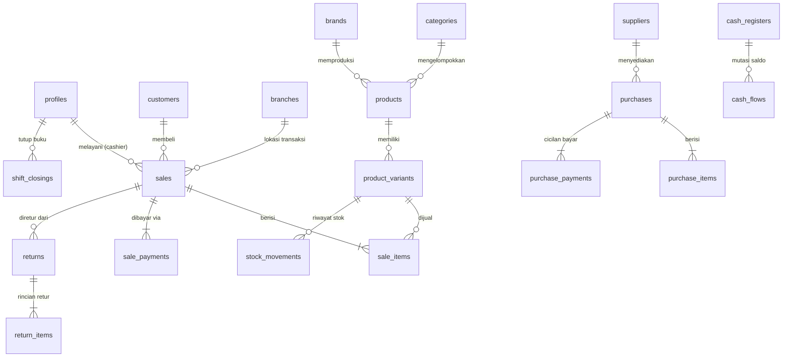

# SPESIFIKASI BACKEND: SEPTY SOFTLENS POS & ERP
**Dokumen Arsitektur & Spesifikasi Database Supabase**  
*Versi:* 1.0.0-PROD  
*Status:* Menunggu Konfirmasi User (Tahap 1 Selesai)

---

## 1. RINGKASAN ARSITEKTUR SISTEM

Sistem **Septy Softlens POS** menggunakan arsitektur *Database-Centric Serverless*:
- **Frontend:** Next.js (TypeScript, React 19, Tailwind CSS) dideploy di **Cloudflare Pages** dengan mode static export (`output: 'export'`).
- **Backend & Database:** **Supabase (PostgreSQL 15+)**.
- **Security Boundary:** Frontend hanya menggunakan `NEXT_PUBLIC_SUPABASE_ANON_KEY`. Seluruh batasan hak akses, validasi bisnis, locking stok, dan penulisan dokumen diproteksi di sisi database melalui:
  1. **Row-Level Security (RLS)** dengan helper function `current_user_role()`.
  2. **PL/pgSQL Stored Procedures (RPC)** bertanda `SECURITY DEFINER` dengan parameter validation dan `SET search_path = public, pg_temp`.
  3. **Trigger Integritas Database** (auto-numbering sequence, updated_at, immutable stock movements ledger, constraint checks).

---

## 2. AUDIT LENGKAP MODUL & FITUR FRONTEND

Berdasarkan audit menyeluruh terhadap 25+ halaman dashboard di `src/app`:

| No | Modul / Halaman | Form Input & Filter | Tabel & Data Output | Aksi Tombol | Kebutuhan Backend / RPC |
|:---|:---|:---|:---|:---|:---|
| 1 | **Login & Register** (`/(auth)/login`, `/register`) | Email, Password, Nama Owner, Nama Toko | Status otentikasi | Buka Kunci Mesin, Daftar Toko | Supabase Auth (`signUp`, `signInWithPassword`), trigger pembuatan profil |
| 2 | **Super Admin Panel** (`/superadmin`) | Input Email Manual, Search | List pengguna, status email, tanggal daftar | Konfirmasi Email & Aktifkan | `confirm_user_email(email)`, `get_all_users_for_admin()` |
| 3 | **Kasir (POS)** (`/pos`) | Search produk, Barcode scanner input, Diskon (Rp), Pelanggan select, Split payment (Tunai, Transfer, QRIS), Channel Penjualan (Toko, WA, Marketplace) | Grid produk, Keranjang belanja (item, qty, harga, subtotal), Ringkasan pembayaran & kembalian | Tambah ke Keranjang, Ubah Qty (+/-), Catat Pengeluaran Cepat, Pelanggan Baru Cepat, Selesaikan Transaksi | `create_sale(payload)` (atomik: lock stok, potong stok, catat ledger, catat sales, items, payments, arus kas) |
| 4 | **Riwayat Transaksi** (`/riwayat-transaksi`) | Pencarian ID/Pelanggan/Metode, Filter tanggal | ID Struk, Waktu, Pelanggan, Metode Bayar, Total, Status | Detail Struk Transaksi, Cetak Ulang Struk, Void/Batalkan Transaksi | `get_sale_details(sale_id)`, `cancel_sale(sale_id, reason)` |
| 5 | **Master Barang** (`/products`) | Kode, Nama, Kategori, Brand, Tipe, Warna, SKU, HPP, Harga Regular, Harga Gold, Harga VIP, Stok Awal, Min Stok | List produk, harga berjenjang, stok global | Tambah Produk, Edit Produk, Hapus Produk, Import/Export | CRUD `products`, relasi `categories`, `brands`, mutasi stok awal |
| 6 | **Kategori Barang** (`/categories`) | Nama Kategori, Target Margin Profit (%), Lacak Expired Date (boolean) | List kategori, margin, status expired | Tambah Kategori, Edit, Hapus | CRUD `categories` |
| 7 | **Pelanggan & CRM** (`/customers`) | Nama, No WA/Telp, Alamat, Level (REGULER, GOLD, VIP), Catatan Resep Minus/Silinder Mata (R/L) | List pelanggan, total poin, riwayat belanja | Tambah Pelanggan, Edit, Hapus, Riwayat Poin | CRUD `customers`, tracking poin belanja |
| 8 | **Master Promo** (`/promos`) | Nama Promo, Jenis (Diskon %, Potongan Rp, Buy X Get Y), Target, Periode, Minimal Belanja | List promo aktif, jenis, periode | Tambah Promo, Toggle Aktif, Hapus | CRUD `promos`, evaluasi diskon di `create_sale` |
| 9 | **Master Reward & Poin** (`/rewards`) | Config kelipatan transaksi, umur poin, Form hadiah (Nama reward, Poin dibutuhkan) | Konfigurasi aktif, list hadiah | Simpan Pengaturan Poin, Tambah Hadiah, Hapus | CRUD `rewards`, `store_settings` |
| 10 | **Buku Kas & Kantong Kas** (`/cashflow`) | Buat Kantong Kas (nama, saldo awal), Catat Arus Kas (tipe IN/OUT, kategori, nominal, deskripsi, kantong kas) | List kantong kas & saldo, tabel mutasi kas | Tambah Kantong, Catat Arus Kas, Hapus Kantong | CRUD `cash_registers`, `cash_flows` |
| 11 | **Tutup Kas / Shift** (`/tutup-kas`) | Input kas fisik aktual, catatan shift | Saldo tunai seharusnya (sistem), selisih, riwayat tutup shift | Kirim Tutup Kas (Rekonsiliasi Shift) | `close_cash_shift(...)`, kalkulasi penjualan tunai shift |
| 12 | **Pembelian & PO** (`/purchases`) | No Faktur, Supplier, Total Biaya, Status (LUNAS, UTANG), Metode Bayar, Rincian item barang | List PO, supplier, status pelunasan, total belanja | Tambah Pembelian Baru, Terima Barang (Receive), Cetak PO | `create_purchase(...)`, `receive_purchase(...)` (tambah stok & update HPP) |
| 13 | **Utang Supplier** (`/suppliers`) | Tambah Tagihan Utang, Filter Supplier, Form Bayar Cicilan | List utang per supplier, tanggal jatuh tempo, sisa tagihan | Catat Utang Baru, Bayar Cicilan Hutang | `pay_purchase_debt(...)`, query rekap utang |
| 14 | **Retur / Tukar Barang** (`/returns`) | No Struk Asal, Barang diretur, Qty, Alasan, Tujuan (Gudang Baik/Rusak), Barang Pengganti, Selisih Harga | List retur, status, nilai selisih, petugas | Proses Retur / Tukar | `create_return(...)` (validasi batas beli, update stok/gudang rusak, sesuaikan kas) |
| 15 | **Gudang Barang Bermasalah** (`/warehouse`) | Form catat rusak/expired (Kode, Nama, Qty, Kategori, HPP, Keterangan) | Total Pcs di gudang rusak, Modal tertahan, list barang | Catat Barang Bermasalah, Klaim Pabrik, Musnahkan | CRUD `damaged_goods`, catat loss ke ledger stok |
| 16 | **Stok Mengendap** (`/slow-moving`) | Filter periode (≥ 1, 2, 3 Bulan), Sortir | Produk, stok, umur barang, terakhir laku, modal tertahan | Diskonkan Cepat (ke Promo) | `get_slow_moving_products(days)` |
| 17 | **AI Restock** (`/restock`) | Filter pencarian, buffer hari aman | Rekomendasi restock (kecepatan jual/hari, sisa stok, saran qty, est biaya) | Jalankan Analisis AI, Buat PO Langsung | `get_ai_restock_recommendations()` |
| 18 | **Laporan Utama & ERP** (`/laporan-utama`, `/reports`) | Filter periode tanggal, Filter cabang | Omzet, HPP, Laba Kotor, Laba Bersih, Pengeluaran, Kinerja Kasir | Filter Lanjut, Export CSV / Excel | `get_comprehensive_report(start_date, end_date, branch_id)` |
| 19 | **Executive Dashboard** (`/owner-dashboard`, `/`) | Filter periode | Metrik Omzet, Laba, Aset Stok, Saldo Kas Realtime, Chart Tren | Refresh Data, Navigasi Cepat | `get_owner_dashboard_metrics()` |
| 20 | **Pusat Approval Owner** (`/approvals`) | Kategori approval (Harga di bawah margin, Pengeluaran kasir, Selisih shift, Gudang) | List antrean permohonan wewenang | Setujui, Tolak | CRUD `approvals`, update status transaksi terkait |
| 21 | **Manajemen Karyawan** (`/users`) | Nama, Email, Cabang, Role (OWNER, ADMIN, KASIR), Hak Akses | List karyawan, cabang, status aktif | Tambah Karyawan, Edit, Hapus | CRUD `profiles`, relasi Supabase Auth |
| 22 | **Pengaturan Sistem** (`/settings`) | Tambah Cabang, Toggle Switch Harga di Kasir, Target Kinerja, Insentif SP, Matrix Hak Akses | Pengaturan toko, list cabang, toggle matriks izin | Simpan Pengaturan, Backup JSON, Sync Printer/Scanner | CRUD `store_settings`, `branches`, backup RPC |
| 23 | **Profil Toko** (`/store-profile`) | Nama Toko, Alamat, No WA, Footer Struk, Teks RAW QRIS, Mode Gelap | Data profil tersimpan | Simpan Perubahan | CRUD `store_settings` |
| 24 | **Audit Trail** (`/audit-trail`) | Cari, Filter Aktivitas, Filter User, Dari/Sampai Tanggal | Tanggal, Jam, User, Aktivitas, Data Sebelum, Data Sesudah, Alasan | Catat Aktivitas Sistem, Filter Cepat | `audit_logs` (read-only query & trigger otomatis) |

---

## 3. PEMETAAN SKEMA DATABASE (TABEL & RELASI)



### Daftar 24 Tabel Inti:
1. `profiles`: `id (UUID PK -> auth.users)`, `email`, `full_name`, `role (OWNER/ADMIN/KASIR)`, `status (ACTIVE/PENDING/INACTIVE)`, `branch_id`, timestamps.
2. `branches`: `id (UUID PK)`, `name`, `address`, `phone`, `is_active`, timestamps.
3. `store_settings`: `id (UUID PK)`, `store_name`, `address`, `phone`, `receipt_footer`, `qris_raw_data`, `allow_cashier_price_change`, `enable_incentives`, `incentive_per_item`, `incentive_upselling_percent`, `target_upselling_count`, `inventory_cost_method ('WEIGHTED_AVG' / 'LAST_PURCHASE')`, `tax_percent`, timestamps.
4. `categories`: `id (UUID PK)`, `name`, `target_margin_percent`, `track_expired`, `deleted_at`, timestamps.
5. `brands`: `id (UUID PK)`, `name`, timestamps.
6. `products`: `id (UUID PK)`, `category_id`, `brand_id`, `code (UNIQUE)`, `name`, `description`, `deleted_at`, timestamps.
7. `product_variants`: `id (UUID PK)`, `product_id`, `sku (UNIQUE)`, `barcode`, `variant_name`, `power (minus/plus)`, `diameter`, `base_curve`, `color`, `expiry_date`, `cost_price (HPP)`, `price_regular`, `price_gold`, `price_vip`, `stock`, `min_stock`, `deleted_at`, timestamps.
   - *Check constraints:* `stock >= 0`, `cost_price >= 0`, `price_regular >= 0`.
8. `customers`: `id (UUID PK)`, `name`, `phone`, `customer_level ('REGULER'/'GOLD'/'VIP')`, `points`, `total_spend`, `prescription_notes (JSONB: minus R/L, cyl, axis, pd)`, timestamps.
9. `suppliers`: `id (UUID PK)`, `name`, `contact_person`, `phone`, `address`, `total_debt`, timestamps.
10. `sales`: `id (UUID PK)`, `invoice_number (UNIQUE: INV-YYYYMMDD-XXXX)`, `branch_id`, `customer_id`, `cashier_id`, `sales_channel ('Toko'/'WhatsApp'/'Marketplace')`, `subtotal`, `discount_amount`, `tax_amount`, `total_amount`, `total_cost (total HPP)`, `payment_status ('PAID'/'PARTIAL'/'UNPAID')`, `status ('COMPLETED'/'CANCELLED'/'HELD')`, `idempotency_key (UNIQUE)`, `notes`, timestamps.
11. `sale_items`: `id (UUID PK)`, `sale_id`, `variant_id`, `qty`, `cost_price_at_sale (snapshot HPP)`, `sell_price_at_sale`, `discount_item`, `subtotal`, timestamps.
12. `sale_payments`: `id (UUID PK)`, `sale_id`, `payment_method ('TUNAI'/'TRANSFER'/'QRIS')`, `amount`, `reference_number`, `cash_register_id`, timestamps.
13. `held_sales`: `id (UUID PK)`, `hold_number`, `customer_id`, `cashier_id`, `cart_data (JSONB)`, timestamps.
14. `purchases`: `id (UUID PK)`, `po_number (UNIQUE: PO-YYYYMMDD-XXXX)`, `supplier_id`, `invoice_number_supplier`, `purchase_date`, `total_cost`, `total_paid`, `debt_balance`, `payment_status ('LUNAS'/'UTANG'/'PENDING')`, `status ('ORDERED'/'RECEIVED'/'CANCELLED')`, timestamps.
15. `purchase_items`: `id (UUID PK)`, `purchase_id`, `variant_id`, `qty`, `cost_per_unit`, `subtotal`, timestamps.
16. `purchase_payments`: `id (UUID PK)`, `purchase_id`, `payment_date`, `amount`, `payment_method`, `cash_register_id`, `notes`, timestamps.
17. `returns`: `id (UUID PK)`, `return_number (UNIQUE: RTN-YYYYMMDD-XXXX)`, `sale_id`, `customer_id`, `cashier_id`, `return_type ('EXCHANGE'/'REFUND')`, `price_difference`, `status ('COMPLETED'/'CANCELLED')`, timestamps.
18. `return_items`: `id (UUID PK)`, `return_id`, `returned_variant_id`, `qty_returned`, `reason`, `destination ('RESTOCKED'/'DAMAGED')`, `exchange_variant_id`, `qty_exchange`, timestamps.
19. `stock_movements`: `id (UUID PK)`, `variant_id`, `movement_type ('SALE'/'PURCHASE'/'RETURN'/'ADJUSTMENT'/'DAMAGED_WRITE_OFF')`, `qty_change (positif/negatif)`, `qty_after`, `reference_table`, `reference_id`, `notes`, `created_by`, `created_at`.
   - *Prinsip:* **Append-Only Ledger** (tidak bisa di-update/dihapus via database rule).
20. `stock_adjustments`: `id (UUID PK)`, `variant_id`, `physical_qty`, `system_qty`, `difference`, `reason`, `approved_by`, timestamps.
21. `damaged_goods`: `id (UUID PK)`, `variant_id`, `qty`, `unit_cost`, `issue_description`, `status ('PENDING'/'CLAIMED_SUPPLIER'/'DESTROYED')`, `resolved_at`, timestamps.
22. `cash_registers`: `id (UUID PK)`, `branch_id`, `name (e.g. Kas Utama, Kas Laci Toko, Rekening BCA)`, `balance`, timestamps.
23. `cash_flows`: `id (UUID PK)`, `cash_register_id`, `flow_type ('IN'/'OUT')`, `category`, `amount`, `reference_table`, `reference_id`, `description`, timestamps.
24. `shift_closings`: `id (UUID PK)`, `cashier_id`, `branch_id`, `shift_start`, `shift_end`, `system_cash`, `actual_cash`, `difference`, `status ('PAS'/'LEBIH'/'KURANG')`, `notes`, timestamps.
25. `promos`: `id (UUID PK)`, `name`, `promo_type ('PERCENT'/'FLAT'/'BUY_X_GET_Y')`, `discount_value`, `target_category_id`, `min_purchase`, `start_date`, `end_date`, `is_active`, timestamps.
26. `rewards`: `id (UUID PK)`, `name`, `points_required`, `stock_available`, `is_active`, timestamps.
27. `approvals`: `id (UUID PK)`, `category ('PRICE_OVERRIDE'/'EXPENSE'/'CASH_DIFF'/'DAMAGED_WRITE_OFF')`, `title`, `requester_id`, `details (JSONB)`, `status ('PENDING'/'APPROVED'/'REJECTED')`, `decided_by`, timestamps.
28. `audit_logs`: `id (UUID PK)`, `user_id`, `activity`, `table_name`, `record_id`, `data_before (JSONB)`, `data_after (JSONB)`, `reason`, `ip_address`, `created_at`.

---

## 4. FUNGSI PL/pgSQL & LOGIKA BISNIS (RPC)

Semua fungsi bertipe `SECURITY DEFINER` dan mengecek `current_user_role()` untuk validasi otorisasi.

### 4.1. `create_sale(p_payload JSONB) -> JSONB`
- **Tujuan:** Memproses transaksi checkout kasir secara 100% atomik (ACID).
- **Alur Kerja:**
  1. Validasi Idempotency Key: jika `idempotency_key` sudah pernah sukses, kembalikan invoice yang sama.
  2. Kunci Baris Stok: `SELECT stock, cost_price, price_regular FROM product_variants WHERE id = ANY(...) FOR UPDATE;`
  3. Cek Ketersediaan Stok: Jika ada item `qty > stock`, lempar exception `'STOK_TIDAK_CUKUP: [Nama Produk]'`.
  4. Hitung & Validasi Ulang di Server: Subtotal, diskon promo, pajak, total akhir.
  5. Validasi Pembayaran: `total_bayar (tunai + transfer + qris) >= total_akhir`. Hitung kembalian.
  6. Generate Invoice Number otomatis: `INV-YYYYMMDD-XXXX` (lewat sequence harian).
  7. Insert ke `sales`, `sale_items` (dengan snapshot `cost_price_at_sale`), dan `sale_payments`.
  8. Update Stok: `UPDATE product_variants SET stock = stock - qty`.
  9. Catat ke Ledger: Insert ke `stock_movements`.
  10. Catat Arus Kas Masuk: Insert ke `cash_flows` dan update `cash_registers.balance`.
  11. Akumulasi CRM: Tambah `customers.total_spend` dan tambah poin reward.
  12. Return: Objek JSON transaksi lengkap, status sukses, dan nomor struk.

### 4.2. `cancel_sale(p_sale_id UUID, p_reason TEXT) -> JSONB`
- **Hak Akses:** Hanya `OWNER` dan `ADMIN`.
- **Alur Kerja:**
  1. Cek status sale: harus `COMPLETED`.
  2. Kembalikan stok semua varian di `sale_items` ke `product_variants`.
  3. Catat pergerakan stok pembalikan (`movement_type = 'SALE_CANCEL'`).
  4. Kembalikan kas keluar (pengurangan saldo kas di `cash_flows` dan `cash_registers`).
  5. Kurangi poin dan total spend di `customers`.
  6. Update status sale menjadi `CANCELLED`.
  7. Catat aktivitas di `audit_logs`.

### 4.3. `create_return(p_payload JSONB) -> JSONB`
- **Alur Kerja:**
  1. Validasi item retur: `qty_returned <= (qty_terjual - qty_sudah_diretur)`.
  2. Jika tujuan = `'RESTOCKED'`, kembalikan ke stok `product_variants`.
  3. Jika tujuan = `'DAMAGED'`, masukkan ke tabel `damaged_goods`.
  4. Jika ada barang tukar (`exchange_variant_id`):
     - Kunci stok barang pengganti `FOR UPDATE`.
     - Potong stok barang pengganti.
  5. Hitung selisih harga:
     - Jika selisih positif (pelanggan nombok): catat kas masuk.
     - Jika selisih negatif (toko refund): catat kas keluar.
  6. Insert ke `returns` & `return_items`. Catat ledger stok.

### 4.4. `receive_purchase(p_purchase_id UUID) -> JSONB`
- **Alur Kerja:**
  1. Validasi PO status `'ORDERED'`.
  2. Loop setiap item di `purchase_items`:
     - Tambah stok di `product_variants`.
     - Hitung ulang HPP berdasarkan setting toko:
       - **Metode Rata-rata Tertimbang (Weighted Average):**  
         $$HPP_{baru} = \frac{(Stok_{lama} \times HPP_{lama}) + (Qty_{beli} \times Harga_{beli})}{Stok_{lama} + Qty_{beli}}$$
       - **Metode Pembelian Terakhir (Last Purchase):** $HPP_{baru} = Harga_{beli}$.
     - Update `product_variants` dengan stok baru dan HPP baru.
     - Catat ke `stock_movements` (`movement_type = 'PURCHASE'`).
  3. Catat penambahan utang di `suppliers.total_debt` jika status PO adalah `'UTANG'`.
  4. Update status PO menjadi `'RECEIVED'`.

### 4.5. `close_cash_shift(p_payload JSONB) -> JSONB`
- **Alur Kerja:**
  1. Hitung total penjualan tunai kasir sejak shift dimulai:  
     `SELECT COALESCE(SUM(amount), 0) FROM sale_payments ... WHERE payment_method = 'TUNAI'`.
  2. Kurangi pengeluaran kas operasional kasir pada shift tersebut.
  3. Dapatkan `system_cash`.
  4. Hitung selisih: `difference = actual_cash - system_cash`.
  5. Tentukan status: `PAS` (0), `LEBIH` (>0), `KURANG` (<0).
  6. Insert ke `shift_closings`.
  7. Jika ada selisih, buat entri otomatis di `approvals` untuk review Owner.

### 4.6. `get_owner_dashboard_metrics() -> JSONB`
- Menghitung agregasi server-side berindeks efisien:
  - Total Omzet Bulan Ini
  - Total Laba Kotor Bulan Ini (Omzet - HPP riil)
  - Total Nilai Aset Stok (HPP $\times$ Stok)
  - Total Saldo Kas (Semua kantong kas aktif)
  - 5 Produk Terlaris & 5 Produk Menipis (< min_stock)

---

## 5. KEAMANAN & MATRIX ROW LEVEL SECURITY (RLS)

### Helper Functions:
```sql
CREATE OR REPLACE FUNCTION current_user_role()
RETURNS TEXT
LANGUAGE sql
STABLE
AS $$
  SELECT role FROM public.profiles WHERE id = auth.uid();
$$;
```

### Matriks Akses Per Role:

| Tabel | Role: OWNER | Role: ADMIN | Role: KASIR |
|:---|:---:|:---:|:---:|
| `profiles` | FULL ACCESS | READ ONLY | READ OWN ONLY |
| `store_settings` | FULL ACCESS | READ ONLY | READ ONLY |
| `branches` | FULL ACCESS | READ ONLY | READ ONLY |
| `categories`, `brands`, `products`, `variants` | FULL ACCESS | FULL ACCESS | READ ONLY |
| `customers` | FULL ACCESS | FULL ACCESS | READ & CREATE |
| `sales`, `sale_items`, `sale_payments` | FULL ACCESS | READ ONLY | CREATE & READ OWN |
| `purchases`, `suppliers` | FULL ACCESS | FULL ACCESS | NO ACCESS |
| `cash_registers`, `cash_flows` | FULL ACCESS | READ ONLY | CREATE (Pengeluaran Kasir Saja) |
| `shift_closings` | FULL ACCESS | READ ONLY | CREATE OWN |
| `returns` | FULL ACCESS | FULL ACCESS | CREATE ONLY |
| `stock_adjustments`, `damaged_goods` | FULL ACCESS | FULL ACCESS | NO ACCESS |
| `stock_movements` (Ledger) | READ ONLY | READ ONLY | READ ONLY (Append via RPC) |
| `audit_logs` | READ ONLY | NO ACCESS | NO ACCESS |

---

## 6. POIN KONFIRMASI KEPUTUSAN BISNIS (MOHON PERSETUJUAN USER)

Sebelum kami mengeksekusi kode SQL Migrasi (Tahap 2) dan Service Layer (Tahap 6), mohon konfirmasi untuk 4 poin aturan bisnis berikut:

1. **Metode Kalkulasi HPP Stok (Cost Method):**
   - **Opsi A (Direkomendasikan):** *Weighted Average Cost (Rata-rata tertimbang)* — HPP dihitung ulang secara proporsional setiap kali ada pembelian barang baru masuk.
   - **Opsi B:** *Last Purchase Price (Harga Pembelian Terakhir)* — HPP langsung digantikan oleh harga beli pada faktur terakhir.
   *(Default: Opsi A)*

2. **Perhitungan Pajak Penjualan (PPN):**
   - Apakah sistem saat ini menggunakan PPN (misal 11%), atau harga jual di kasir sudah merupakan harga nett (pajak 0%)?
   *(Default: Pajak 0% / include, dapat diatur di Pengaturan)*

3. **Kebijakan Diskon Bertumpuk & Pembulatan:**
   - Jika ada diskon member (misal VIP) dan diskon voucher promo, apakah boleh digabung (*stackable*), atau hanya diambil diskon tertinggi?
   - Apakah total pembayaran tunai dibulatkan ke kelipatan ratusan rupiah terdekat?
   *(Default: Diskon tertinggi / non-stackable, tanpa pembulatan desimal)*

4. **Kebijakan Retur Barang:**
   - Di tampilan UI tertulis: *"Hanya melayani tukar barang"*.
   - Jika barang pengganti lebih murah daripada barang asal, apakah sisa uang dikembalikan tunai (*refund kas*), atau dijadikan poin/deposit pelanggan?
   *(Default: Dikembalikan tunai via kasir jika ada selisih lebih murah)*

---

*Silakan konfirmasi atau berikan masukan Anda untuk 4 poin di atas agar kami dapat melanjutkan ke **Tahap 2 (Migrasi Database SQL Lengkap & Idempotent)**.*
